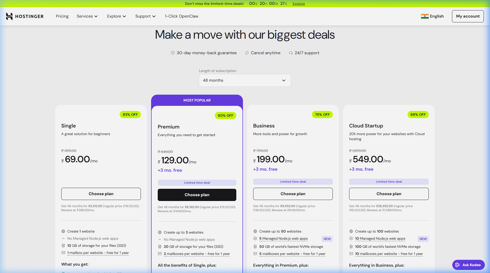
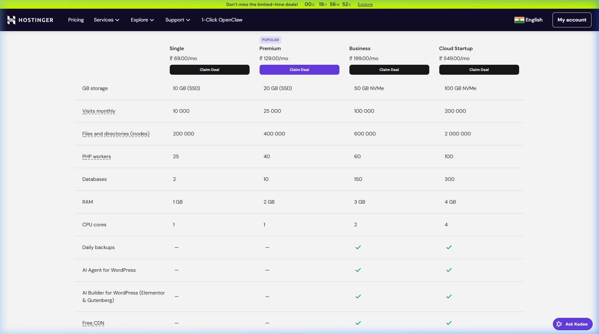

# 🌐 OZOBATH — Domain, Hosting & Email Setup Proposal

---

## Recommended Plan: Hostinger Business Web Hosting

I recommend the **Hostinger Business Web Hosting** plan. It is the most cost-effective option that gives us **everything we need in one place** — domain, professional emails, hosting, and security.

### Pricing

| Item | Detail |
|------|--------|
| **Plan** | Business Web Hosting |
| **Duration** | 48 months (Best value) |
| **Monthly Cost** | **₹199/month** (75% OFF from ₹799) |
| **Total Cost** | **₹9,552** for 4 years |
| **Bonus** | +3 months FREE |

> ⚠️ **Note:** 18% GST will be added additionally at the time of payment. Estimated GST: ~₹1,720. So the **total payable amount will be approximately ₹11,270** (domain + hosting + email for 4 years).

---

## ✅ What's Included (FREE with this plan)

### 🌐 Free Domain
| Feature | Detail |
|---------|--------|
| **Free Domain** | ✅ **ozobath.com** (1st year FREE, worth ₹799+) |
| **WHOIS Privacy** | ✅ Included FREE (hides personal info from public records) |
| **Domain Lock** | ✅ Prevents unauthorized transfers |

### 📧 Professional Email (5 Accounts FREE)
| Feature | Detail |
|---------|--------|
| **Email Accounts** | **5 mailboxes** per website (FREE for 1st year) |
| **Example Emails** | info@ozobath.com, admin@ozobath.com, support@ozobath.com, sales@ozobath.com, noreply@ozobath.com |
| **Storage** | 1 GB per account |
| **Daily Sending** | ~300 emails/day |

### 🖥️ Hosting & Performance
| Feature | Detail |
|---------|--------|
| **Storage** | 50 GB NVMe SSD (super fast) |
| **Websites** | Up to 50 |
| **Node.js Apps** | 5 Managed Node.js web apps |
| **RAM** | 3 GB |
| **CPU** | 2 Cores |
| **Monthly Visits** | Up to 100,000 |
| **Daily Backups** | ✅ Automatic |

### 🔒 Security
| Feature | Detail |
|---------|--------|
| **SSL Certificate** | ✅ Unlimited FREE SSL |
| **CDN** | ✅ Free Cloudflare CDN |
| **DDoS Protection** | ✅ Included |
| **Malware Scanner** | ✅ Included |

### 🎯 Support
| Feature | Detail |
|---------|--------|
| **24/7 Support** | ✅ Priority customer support |
| **Money-Back** | 30-day money-back guarantee |

---

## 💳 How to Purchase

### Option A: You Purchase Directly (Recommended)
If you would like to purchase it yourself:

1. Go to **[hostinger.in/web-hosting](https://www.hostinger.in/web-hosting)**
2. Select **Business** plan → Click **"Claim Deal"**
3. Choose **48 months** duration
4. Enter domain: **ozobath.com**
5. Create account with your email
6. Complete payment (UPI / Card / NetBanking)
7. Share the **Hostinger login credentials** with me so I can set up the emails and configure everything

### Option B: I Purchase on Your Behalf
If you want me to handle the purchase:

1. Share a **Gmail address** that I can use to create the Hostinger account
2. Confirm the domain name: **ozobath.com**
3. Transfer the amount: **~₹11,270** (₹9,552 + 18% GST)
4. I will complete the purchase, set up the domain, and configure all 5 email accounts

---

## 📋 What I Need From You

| # | Requirement | Why |
|---|------------|-----|
| 1 | **Confirm domain name** — ozobath.com | To register the domain |
| 2 | **Choose purchase option** — A or B (above) | To proceed with setup |
| 3 | **Full Name & Phone** | Required for domain registration |
| 4 | **Business Address** | Required for domain WHOIS records |

---

## ⏱️ Timeline

Once the domain and hosting are purchased, I will complete the following setup within **1 hour**:

- ✅ Domain configuration (DNS records)
- ✅ SSL certificate activation
- ✅ 5 professional email accounts
- ✅ Email testing and verification

---

> 💡 **Why Hostinger?** It's the most affordable option that includes domain + email + hosting + SSL + CDN + backups — all in one place. No need to purchase separately from different providers.

**Looking forward to your confirmation! 🚀**
